# Introduction

## What is Playwright?

Playwright is an open-source tool and node js library by Microsoft for automating web browser testing.We can also test the API is the backend and test the mobile browsers but not the native applications.It is framework which enables the End-to-End testing.Beyond the browser automation, this offers a dedicated API for testing and interacting with the web APIs.

## Node Js

It is an open-source,cross platform Javascript runtime environment that executes JavaScript code outside of a web browser.

## Features Available

This works on the multiple browsers like Chromium (Chrome,Edge),FireFox, Safari(webkit)

1. Cross - Platforms:Runs on Windows ,Mac and Linux
2. Cross - Language : We can run the tests in JavaScript,TypeScript ,Java ,Python or C#(.net)
3. Test Mobile Web : supports mobile testing for Chrome(Android) and Safari(iOS).
   API testing
4. Automatic Waiting(Auto-Wait): Playwright waits for elements to be ready before performing actions,reducing test flakiness.by default : 30 Seconds.
5. Handles Complex Elements: Easily interacts with Shadow DOM elements,which are tricky for other tools.
6. Parellel Execution: Supports running tests simultaneously in multiple browser instances for faster execution.
7. Built-in Reporters: Provides various report formats like HTML,JSON,JUnit and more.Supports third-party reporting tools like Allure.
8. Inspector: Helps debug tests by showing click points and verifying locators in real time.
9. Code generation: Code gen this tool records your actions and converts them into test scripts in any supported language.
10. TraceViewer: Captures screenshots,record videos ,retries flaky tests, and logs steps automatically.Captures all the information to investigate the test failure.

## JavaScript ---> Dynamically typed language

- let age = 30
- let name = "John"

## TypeScript ---> Statically typed language

- let age:number = 30
- let name:string = "John"

## Why TypeScript

JavaScript (ES3,ES4,ES5,ES6) ECMAScript(ES) is the standard to which all JavaScript code must comply.
It is a superset of JavaScript itself.

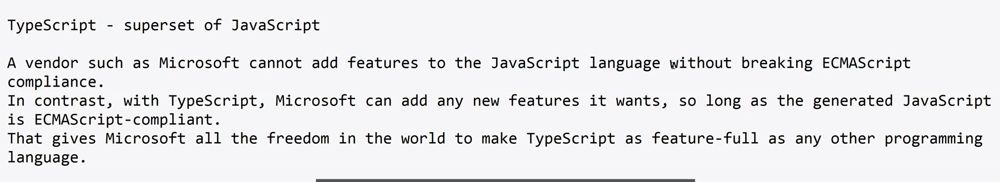

## Getting Started with TypeScript

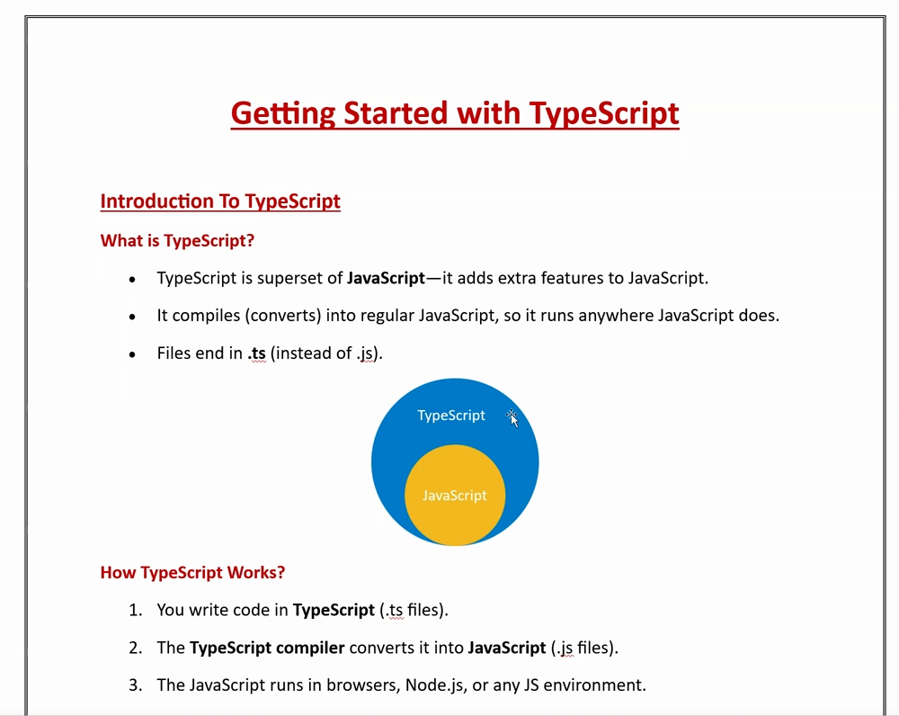

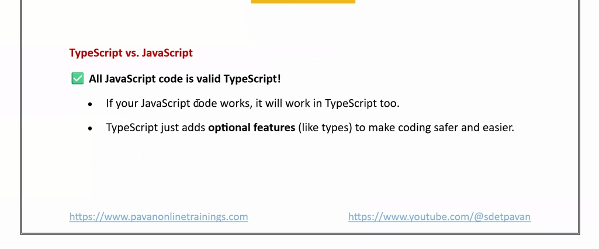
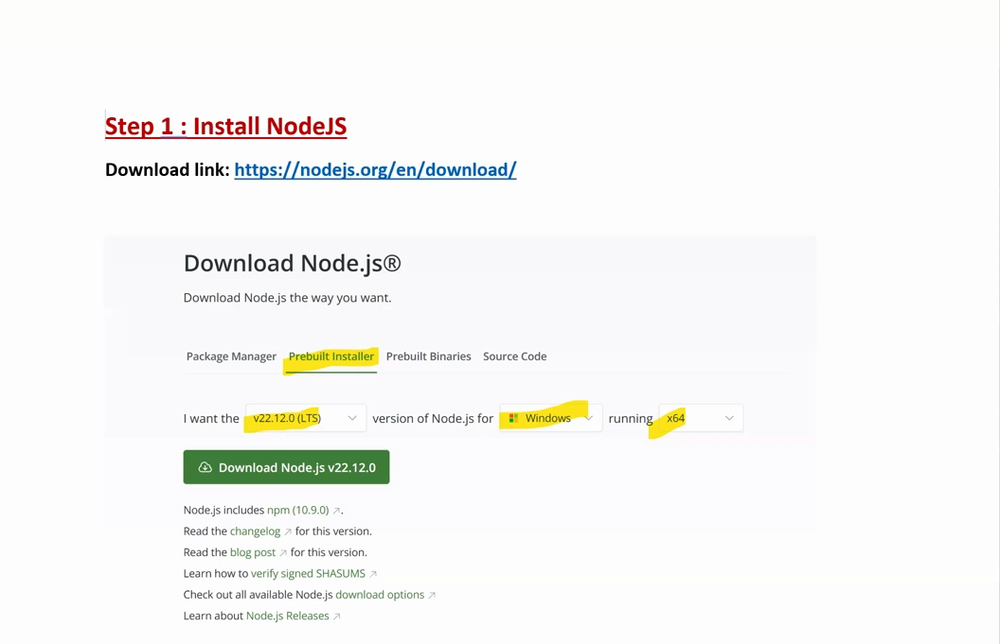

## npm - node package manager

`npx tsc script.ts` - Converts typeScript into JavaScript file.

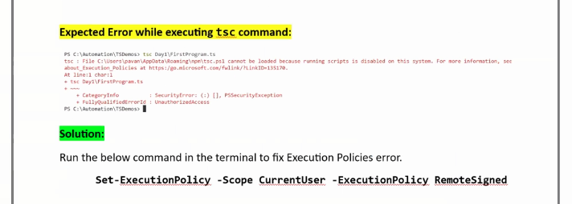
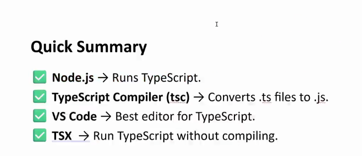

## TypeScript Executer

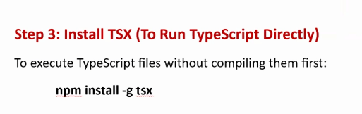

`tsx path of the file name` - No JS file is created directly executes the tsx file.

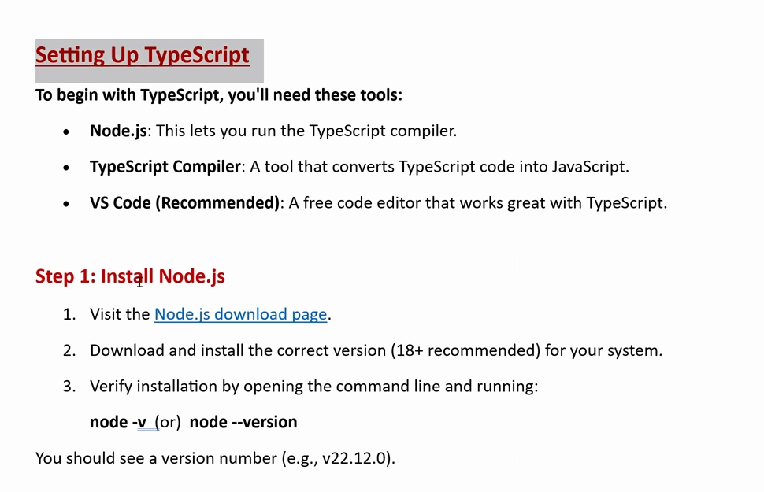

# TYPESCRIPT VARIABLES

# JavaScript Variables & TypeScript Quick Reference Guide

A comprehensive guide covering `var`, `let`, and `const`, as well as setting up and executing TypeScript files.

---

## 📊 JavaScript Variables: `var` vs `let` vs `const`

### Comparison Table

| Feature               | `var`                                              | `let`                                 | `const`                               |
| :-------------------- | :------------------------------------------------- | :------------------------------------ | :------------------------------------ |
| **1. Scope**          | **Function Scope** (Ignores block `{}` boundaries) | **Block Scope** (Constrained to `{}`) | **Block Scope** (Constrained to `{}`) |
| **2. Declaration**    | Can declare without initial value                  | Can declare without initial value     | **Must** initialize at declaration    |
| **3. Re-Declaration** | Allowed in same scope                              | ❌ Not allowed in same scope          | ❌ Not allowed in same scope          |
| **4. Re-Assignment**  | Allowed                                            | Allowed                               | ❌ Not allowed (Immutable reference)  |
| **5. Hoisting**       | Hoisted with `undefined`                           | Hoisted in Temporal Dead Zone (TDZ)   | Hoisted in Temporal Dead Zone (TDZ)   |

---

### Variable Scope Comparison Diagram

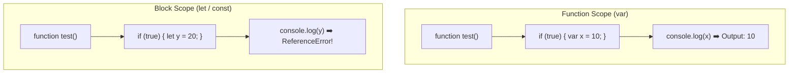

## Variable

It's a container which can hold/store some data.
we use the var, let and const keywords to declare variables in TypeScript.

### Difference between the var vs let vs const

1. Scope
2. Declaration/Value Assignment
3. Re-Declaration
4. Re-initialization/Re-assignment
5. Hoisting

### Var

We do not use this in Modern JS/TS.Avoid var because it has function scope and can lead to unexpected.Here the console can be written outside or inside the block scope.

### Let -- Block Scope

Use let when you need a variable that can change

### Const -- Block Scope

Use const when the variable value should not change.

1. Scope - Accessible area (Functional Scope & Block Scope)

### Hoisting Behavior Diagram

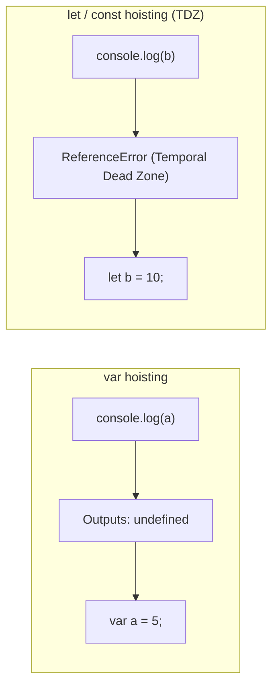

## Declaration/Value Assignment

Let can be declared without initialization.
Const must be initialized at the time of declaration

## Redeclaration

var allows the Re-declaration
let and const not allows the Re-declaration(making the code safer)

## Re-Initialization or Re-Assignment

Var and let the Re-assignments are allowed
Const the re-assignment is not allowed.

## Hoisting

This means trying to console the variable before declaring them.Var will be Hoisted with the undefined whereas let and const cannot be accessed before the initailization.

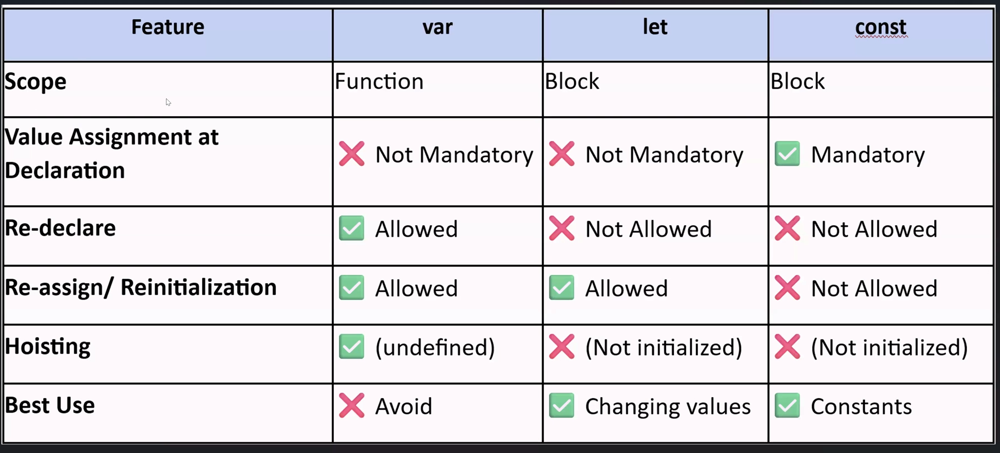
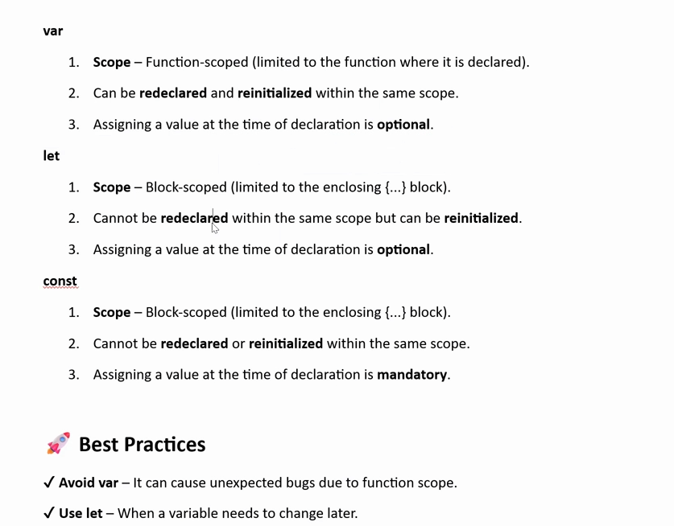

## JavaScript

This is dynamically typed programming language.In JS we cannot explicitly provide the data types.

### Type Safety

JS is not typesafety language.

## TypeScript

TS is statically typed programming language.When we explicitly declares data types and tries to run the command in the node
SyntaxError: Unexpected token ':' will be displayed.

## Data Types

```typescript
let age: number = 30;
```

### Annotation

Here the number is the Data Type and **Annotaion** means when we are explicitly applying a data type to the particular varaible is called as _Annotaion_

```typescript
let age: number = 20;
```

Here this `:number` is **Annotaion**

### Type Inference

```typescript
let age = 30;
```

If we dont specify any data type, the Typescript will allocate some data type to this variable based on the value which we have provided.This process is called **Type Inference**

### Types of Data Types

There are two main categories of data types in TypeScript:

#### 1. Primitive Data Types

- `number`
- `string`
- `boolean`
- `null`
- `undefined`
- `symbol`
- `bigint`

#### 2. Non-Primitive / Reference Data Types

- `Array`
- `Object`
- `Class`
- `Function`
- `Interface`
- `Tuple`

#### Other TypeScript Types

TypeScript also provides additional types such as:

- `any`
- `void`
- `unknown`
- `never`
- `union`
- `enum`

The **major difference** is what kind of value they represent and how they are stored/used.

### 1. Primitive Data Types

Primitive types represent **single, simple values**.

```typescript
let age: number = 25;
let name: string = "Anuruth";
let isActive: boolean = true;
```

Here:

- `number` → one numeric value
- `string` → one text value
- `boolean` → `true` or `false`
- `null` → intentional absence of a value
- `undefined` → value has not been assigned

Think of them as **individual pieces of data**.

---

### 2. Non-Primitive / Reference Data Types

Non-primitive types are used to represent **collections, structures, or more complex data**.

```typescript
let names: string[] = ["Achu", "Ammu", "Unni"];
```

Here, `names` contains **multiple values**.

Another example:

```typescript
let user = {
  name: "Achu",
  age: 25,
};
```

The `user` object contains **multiple related pieces of data**.

Think of them as **containers or structures that can hold more complex data**.

### Simple comparison

| Primitive                     | Non-Primitive                          |
| ----------------------------- | -------------------------------------- |
| Holds a simple value          | Holds complex/structured data          |
| Usually represents one value  | Can contain multiple values/properties |
| `string`, `number`, `boolean` | `array`, `object`, `class`, `function` |
| Example: `"Achu"`             | Example: `{ name: "Achu", age: 25 }`   |

**Easy way to remember:**

> **Primitive = simple value**
> **Non-Primitive = collection/structure of data**

One important TypeScript point: `any`, `void`, `unknown`, `never`, and union types are **TypeScript-specific types/features**, rather than primitive JavaScript data types.

`null` and `undefined` both indicate **absence of a value**, but they are used differently.

### `undefined`

`undefined` generally means **a value has not been assigned**.

```typescript
let name: string;

console.log(name); // undefined
```

Here, `name` is declared but no value is assigned to it.

Another example:

```typescript
let user;

console.log(user); // undefined
```

**Think:** _"The value is not available yet."_

---

### `null`

`null` means **we intentionally set the value to have no value**.

```typescript
let name: string | null = null;

console.log(name); // null
```

Here, we are explicitly saying:

> "There is currently no name."

**Think:** _"There is intentionally no value."_

---

### Main difference

| `undefined`                              | `null`                       |
| ---------------------------------------- | ---------------------------- |
| Value is not assigned                    | Value is intentionally empty |
| Often occurs automatically               | Usually assigned explicitly  |
| Means "value is missing/not initialized" | Means "no value"             |
| `let x;` → `undefined`                   | `let x = null;` → `null`     |

### Simple example

```typescript
let username; // undefined

let profileImage = null; // intentionally no image
```

So an easy way to remember:

> **`undefined` → I don't have a value.**
> **`null` → I intentionally have no value.**

### `any`

The `any` type allows a variable to hold values of any data type.
It disables TypeScript's type checking for that variable and should be
used carefully.

### Union Type in TypeScript

A **Union Type** allows a variable to have **one of several specified types**.

It is written using the **pipe (`|`) operator**.

### Example

```typescript
let userId: string | number;

userId = "A101";  // ✅ Allowed
userId = 101;     // ✅ Allowed
userId = true;    // ❌ Error
```

Here, `userId` can be **either a `string` or a `number`**, but not a `boolean`.

### Another example

```typescript
let status: "success" | "failed" | "pending";

status = "success";  // ✅
status = "failed";   // ✅
status = "pending";  // ✅
status = "completed"; // Error
```

This is useful when a value can have **different possible types or values**, but you still want TypeScript to restrict what is allowed.

### `any` vs Union Type

| `any`                               | Union Type                  |
| ----------------------------------- | --------------------------- |
| Allows almost any type              | Allows only specified types |
| Reduces type safety                 | Maintains type safety       |
| `string`, `number`, `boolean`, etc. | `string \| number`          |
| Should be used carefully            | Preferred when possible     |

**Easy way to remember:**

> `any` → **Anything is allowed**
> `string | number` → **Only string OR number is allowed**
