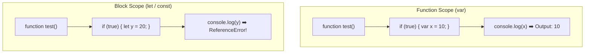
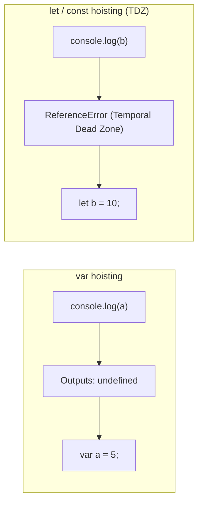

# Introduction
## What is Playwright?
Playwright is an open-source tool and node js library by Microsoft for automating web browser testing.We can also test the API is the backend and test the mobile browsers but not the native applications.It is framework which enables the End-to-End testing.Beyond the browser automation, this offers a dedicated API for testing and interacting with the web APIs.
## Node Js
It is an open-source,cross platform Javascript runtime environment that executes JavaScript code outside of a web browser.
## Features Available
This works on the multiple browsers like Chromium (Chrome,Edge),FireFox, Safari(webkit)
1. Cross - Platforms:Runs on Windows ,Mac and Linux
2. Cross - Language : We can run the tests in JavaScript,TypeScript ,Java ,Python or C#(.net)
3. Test Mobile Web : supports mobile testing for Chrome(Android) and Safari(iOS).
API testing
4. Automatic Waiting(Auto-Wait): Playwright waits for elements to be ready before performing actions,reducing test flakiness.by default : 30 Seconds.
5. Handles Complex Elements: Easily interacts with Shadow DOM elements,which are tricky for other tools.
6. Parellel Execution: Supports running tests simultaneously in multiple browser instances for faster execution.
7. Built-in Reporters: Provides various report formats like HTML,JSON,JUnit and more.Supports third-party reporting tools like Allure.
8. Inspector: Helps debug tests by showing click points and verifying locators in real time.
9. Code generation: Code gen this tool records your actions and converts them into test scripts in any supported language.
10. TraceViewer: Captures screenshots,record videos ,retries flaky tests, and logs steps automatically.Captures all the information to investigate the test failure.

## JavaScript ---> Dynamically typed language
* let age = 30
* let name = "John"
## TypeScript ---> Statically typed language
* let age:number = 30
* let name:string = "John"
## Why TypeScript
JavaScript (ES3,ES4,ES5,ES6) ECMAScript(ES) is the standard to which all JavaScript code must comply.
It is a superset of JavaScript itself.

## Getting Started with TypeScript

## npm - node package manager
`npx tsc script.ts` - Converts typeScript into JavaScript file.

## TypeScript Executer

`tsx path of the file name` - No JS file is created directly executes the tsx file.

# TYPESCRIPT VARIABLES
# JavaScript Variables & TypeScript Quick Reference Guide

A comprehensive guide covering `var`, `let`, and `const`, as well as setting up and executing TypeScript files.

---

## 📊 JavaScript Variables: `var` vs `let` vs `const`

### Comparison Table

| Feature | `var` | `let` | `const` |
| :--- | :--- | :--- | :--- |
| **1. Scope** | **Function Scope** (Ignores block `{}` boundaries) | **Block Scope** (Constrained to `{}`) | **Block Scope** (Constrained to `{}`) |
| **2. Declaration** | Can declare without initial value | Can declare without initial value | **Must** initialize at declaration |
| **3. Re-Declaration** | Allowed in same scope | ❌ Not allowed in same scope | ❌ Not allowed in same scope |
| **4. Re-Assignment** | Allowed | Allowed | ❌ Not allowed (Immutable reference) |
| **5. Hoisting** | Hoisted with `undefined` | Hoisted in Temporal Dead Zone (TDZ) | Hoisted in Temporal Dead Zone (TDZ) |

---

### Variable Scope Comparison Diagram

## Variable 
It's a container which can hold/store some data.
we use the var, let and const keywords to declare variables in TypeScript.
### Difference between the var vs let vs const
1. Scope
2. Declaration/Value Assignment
3. Re-Declaration
4. Re-initialization/Re-assignment
5. Hoisting
### Var
We do not use this in Modern JS/TS.Avoid var because it has function scope and can lead to unexpected.Here the console can be written outside or inside the block scope.
### Let -- Block Scope
Use let when you need a variable that can change
### Const -- Block Scope
Use const when the variable value should not change.

1. Scope - Accessible area (Functional Scope & Block Scope)

### Hoisting Behavior Diagram
